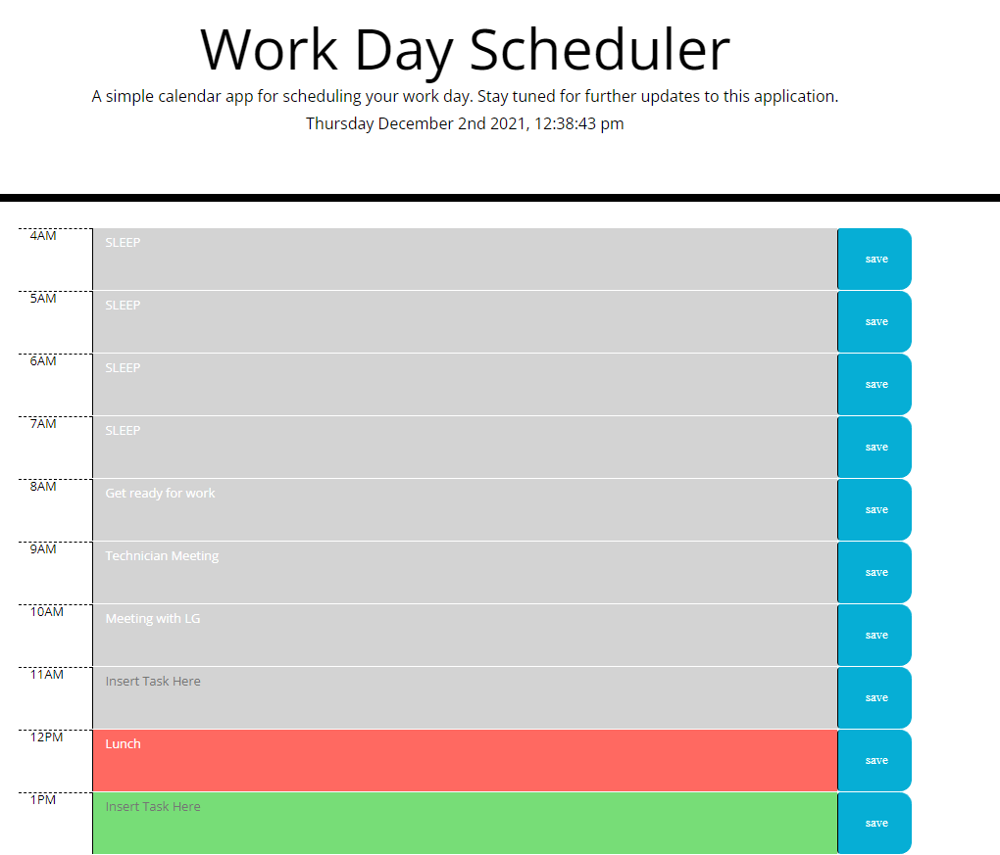

# Daily-Tasks
Simple web-app that will help you create a daily task list and save it to your local storage. The background of each time frame will change based on the current time. If its past the time then it will have a gray background, current time will be red and future times will be green.

## Live link
https://mkang987.github.io/Daily-Tasks/

